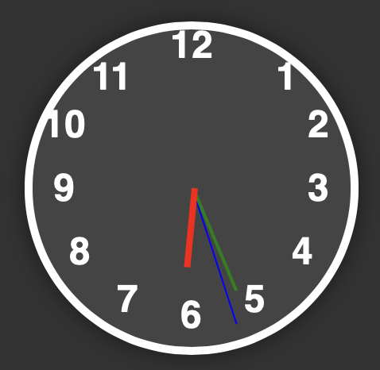

# Horloge Animée

Une horloge numérique élégante et moderne créée à l'aide de HTML, CSS et JavaScript. L'horloge affiche l'heure actuelle avec des aiguilles animées pour les heures, les minutes et les secondes.

## Fonctionnalités

- Affichage en temps réel de l'heure.
- Aiguilles animées pour les heures, les minutes et les secondes.
- Adaptée à tous les écrans et appareils.

## Comment l'utiliser ?

1. Clonez ou téléchargez le dépôt.
2. Ouvrez le fichier `index.html` dans votre navigateur.
3. L'horloge affichera automatiquement l'heure actuelle de votre appareil.

## Personnalisation

Vous pouvez facilement personnaliser le design de l'horloge en modifiant le fichier `styles.css`. Les couleurs, les tailles et autres aspects visuels peuvent être adaptés à vos besoins.

## Contribution

Si vous avez des suggestions ou des améliorations, n'hésitez pas à ouvrir une issue ou à soumettre une pull request. Toutes les contributions sont les bienvenues!